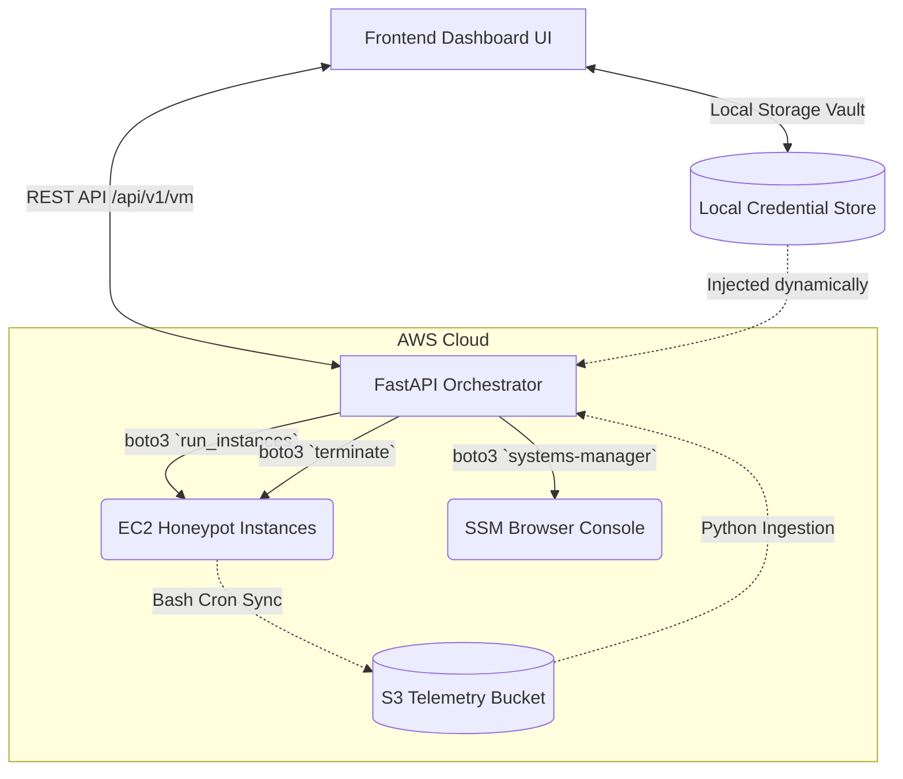

# Shadow Trust: AWS Cloud Infrastructure & Integration Guide

Welcome to the definitive guide for the **Shadow Trust AWS Orchestration Engine**. This document outlines the professional-grade architecture, credential management pipelines, and automated cloud provisioning workflows that power the Cyber Range Virtual Lab.

---

## 🏗️ 1. Architecture Overview

Shadow Trust operates on a **hybrid-cloud architecture** that seamlessly bridges a local management dashboard with the robust, scalable infrastructure of Amazon Web Services (AWS). 

### The Orchestration Stack
1.  **Frontend (UI/UX Terminal):** Built with pure HTML/CSS/JS, featuring a Cyber-Minimalist terminal aesthetic. It acts as the local control plane. Data is transmitted via secure HTTP REST APIs instead of exposing AWS directly to the client.
2.  **Backend (FastAPI Orchestrator):** A high-throughput asynchronous Python engine. It utilizes `boto3` to translate UI commands into executed AWS SDK operations. It also handles local SQLite data ingestion and Supabase data synchronization.
3.  **Cloud Layer (AWS):** The physical execution environment. EC2 hosts the honeypots and threat intelligence labs, while S3 provides scalable, immutable storage for raw attack telemetry.

---

## 🔐 2. Security & Credential Management

Shadow Trust employs a **Just-In-Time (JIT) Credential Injection** paradigm. This is an industry standard for systems orchestrating third-party cloud environments.

*   **No Hardcoded Secrets:** AWS IAM Access Keys and Secret Keys are *never* hardcoded into the Python backend nor permanently stored in the `supabase` cloud database.
*   **Volatile Storage:** Keys entered via the **AWS Connection** (`aws_connection.html`) dashboard are vaulted locally within the user's browser `localStorage`. 
*   **Dynamic Client Instantiation:** When clicking "CREATE" in the Virtual Lab, the Javascript client (`vm_client.js`) attaches the credentials to the payload. The FastAPI backend receives the payload, dynamically instantiates a temporary `boto3` client session into memory, executes the request, and instantly destroys the key references.

---

## 🚀 3. EC2 Virtual Lab Configurations

The platform utilizes predefined Amazon Machine Images (AMIs) specific to the user's AWS account. These AMIs represent snapshot blueprints of our honeypots.

### Verified Active AMIs (ap-south-1)
*   **`ami-0dab019e2f90d9a3d` (Windows Default):** Standard Windows baseline. Target footprint `t3.medium`.
*   **`ami-026489f968e64588d` (Linux Default):** Ubuntu network monitoring layer. Target footprint `t2.medium`.
*   **`ami-083e29ace4dd6d300` (Windows Security Toolkit):** Highly vulnerable sandbox. Target footprint `t3.xlarge`.

*Note: All launched instances are automatically bound to the IAM Role `ShadowTrust-Analysis-Role` and are provisioned with an SSM Agent to allow seamless browser-based console access.*

---

## 🗄️ 4. S3 Data Ingestion Pipeline

Honeypots generate massive amounts of raw log data (Cowrie SSH logs, Dionaea malware captures). Storing this locally on the EC2 instances is risky and ephemeral.

**The Solution:**
1.  All target AMIs will execute a 5-minute background `CRON` job.
2.  The script will bundle logs and securely push them to the designated Amazon S3 Bucket: `honeynet-telemetry-logs`.
3.  The FastApi backend runs an asynchronous background task (`SyncManager`) that pulls from this bucket and indexes the event data into the local SQLite analytics database for instantaneous dashboard rendering.

---

## 🛠️ 5. Setup & Validation Checklist

Before initiating attack simulations, ensure the Cloud Pipeline is active:

- [x] **API Connectivity:** Backend `uvicorn` must be running locally on `http://127.0.0.1:8004`.
- [x] **IAM Provisioning:** Obtain Access/Secret Keys for an AWS IAM user with `AmazonEC2FullAccess` and `AmazonS3FullAccess`.
- [x] **Link Establishment:** Enter the Keys, Region (`ap-south-1`), and Bucket Name (`honeynet-telemetry-logs`) into the dashboard's **AWS Connection** page and click SAVE.
- [ ] **Deployment Test:** Navigate to the **Virtual Lab** and launch the "Linux Default" profile. Verify that the UI enters a "LAUNCHING" state and successfully transitions to "OPEN CONSOLE".
- [ ] **Teardown Test:** Click "TERMINATE" and verify the instance physically vanishes from the AWS EC2 Management Console.

---

### *System Update Log (Latest Patches)*
*   **Critical API Route Fix:** Corrected a port discrepancy where `api.js` was routing backend requests to the frontend UI server (`:5503`) which resulted in `Unexpected token '<' / 405 Method Not Allowed` failures. All telemetry correctly routes to `:8004`.
*   **Orchestrator Bootstrapping:** Hardmapped the verified Custom AMI identifiers (from the Mumbai region) into the API logic.
*   **Deprecated Handlers:** Cleaned orphaned polling scripts (`vm_lab.js`) from the dashboard context to drastically reduce network noise.
