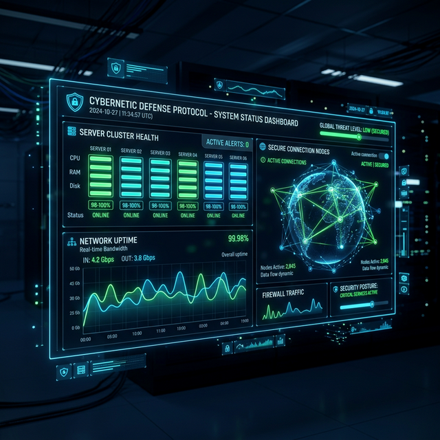

<div align="center">
  
  
  # 🛡️ Shadow Trust
  
  **A Complete, Modular Threat Intelligence & Honeypot Platform with AI-Based Attack Classification**

</div>

---

## 🌟 Overview
Shadow Trust is a next-generation Threat Intelligence Platform designed with a **map-first, intelligence-driven approach**. It combines hybrid edge-to-cloud architecture, seamless global threat monitoring, and advanced analytics to give you unprecedented visibility into cyber attacks.

<div align="center">
  
</div>

## 🚀 Key Features


- **AI Analysis & Classification**: Detects sophisticated SQLi, XSS, Brute Force, and anomalous payloads using heuristic rule-based classifiers and pattern matching.
- **Hybrid Edge + Cloud Design**: Honeypots ingest telemetry locally via SQLite for offline reliability, syncing derived insights to Supabase Postgres.
- **Role-Based Access Control (RBAC)**: Fine-grained permissions featuring Operative, Specialist, Overseer, and Admin roles.
- **Global Threat Intelligence Map**: Real-time visual tracking of attack origins, floating metrics, and localized threat levels.
- **Deep Integrations**: Includes built-in URL Analyzers, Hash ID tooling, and Secret Finders.

## 💡 Usecases & Applications


Whether you're operating a high-security SOC, researching zero-day exploits, or safeguarding business infrastructure, Shadow Trust delivers. Track brute force attempts in real-time or capture full attack payloads via decoy VMs.

## 🛠️ Technology Stack & Architecture

- **Backend / API**: Node.js & Python FastAPI (Hybrid/Modular Async Support)
- **Database Layer**: Supabase (PostgreSQL + Realtime Sync) & SQLite (Edge Node Telemetry)
- **Frontend Panel**: HTML5, Vanilla CSS3 (Neon UI, Map-First Matte Dark), Vanilla JS
- **Honeypot Collector**: Custom Log Collector (real/simulated environments)

## 📂 Project Structure

- `backend/` & `services/`: API applications, background workers, and sync logic.
- `frontend/`: Map-first Web Dashboard, Intelligence overviews, and threat tools.
- `database/` & `supabase/`: Local and cloud Database schema, migrations, and rules.
- `edge/`: Edge node configurations and SQLite schemas.
- `vm_scripts/` & `scripts/`: Remote monitoring scripts for decoy/honeypot environments.

## 📚 API & Documentation


We enforce strict security boundaries. The frontend never accesses edge databases directly. All queries pass through the authenticated API with JWT verification, rate limiting, and audit logging.

## ⚙️ Setup & Deployment Guide

### 1. Prerequisites
- Python 3.9+ / Node.js 18+
- Supabase Account (Free Tier works great)

### 2. Cloud Database (Supabase)
1. Create a new project in Supabase.
2. Run the SQL schemas in `supabase/` to set up tables and RLS policies.
3. Retrieve your `SUPABASE_URL` and `SUPABASE_KEY`.

### 3. Backend API
```bash
cd backend
python3 -m venv venv
source venv/bin/activate
pip install -r requirements.txt

# Environment Setup
echo "SUPABASE_URL=your_url" > .env
echo "SUPABASE_KEY=your_key" >> .env
echo "SECRET_KEY=your_jwt_secret" >> .env

# Run Server
uvicorn app.main:app --reload
```
*(Note: If using the Node.js API from `services/api`, utilize `npm install` and `npm start` instead).*

### 4. Frontend Configuration
Ensure the API paths in `frontend/js/api.js` match your local or production backend environments. Open `frontend/login.html` to begin.

### 5. Start the Edge Node
Deploy `vm_scripts/log_collector.py` or the edge agent to your Linux VM to start collecting live telemetry.
```bash
sudo python3 log_collector.py
```

## 🔐 Authentication & Roles
- **Super Admin Setup**: Register via the signup page. Manually update your user role to `super_admin` in the Supabase backend dashboard to unlock Overseer privileges.

## 📊 System Status



With built-in health endpoints, continuous syncing, and offline edge tolerance, the Threat Intelligence Platform maintains constant vigilance even during network partitions.

---
*Built for the next generation of Cyber Intelligence Operations.*